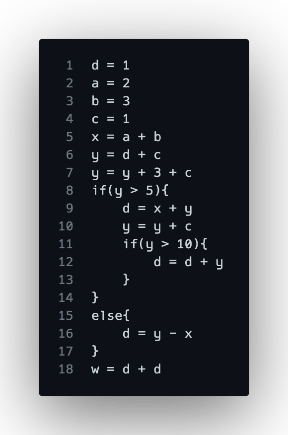
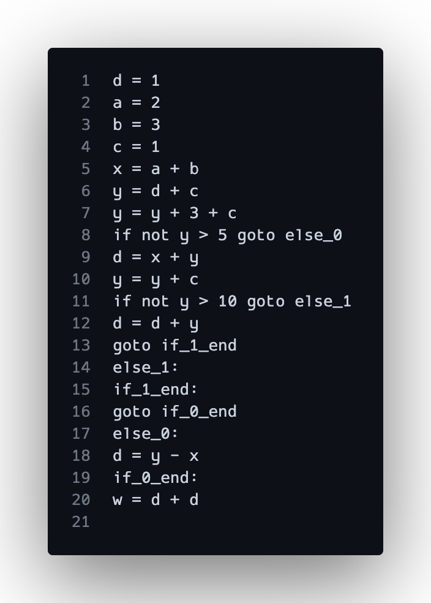

# An Investigation in Various Register Allocation Methods

- [An Investigation in Various Register Allocation Methods](#an-investigation-in-various-register-allocation-methods)
  - [Introduction](#introduction)
  - [Technology and Usage](#technology-and-usage)
  - [Memory Hierarchy](#memory-hierarchy)
  - [Compiler Pipeline](#compiler-pipeline)
    - [Stage 1: Parsing/Lexing](#stage-1-parsinglexing)
    - [Stage 2: Creating an AST](#stage-2-creating-an-ast)
    - [Stage 3: Traversing AST to Generate IR](#stage-3-traversing-ast-to-generate-ir)
  - [Linear Scan](#linear-scan)
    - [Live Interval](#live-interval)
    - [Assign Registers](#assign-registers)
  - [Graph Coloring](#graph-coloring)
    - [More Steps in the Pipeline](#more-steps-in-the-pipeline)
    - [LiveOut Analysis](#liveout-analysis)
    - [Create RIG and Assign Registers](#create-rig-and-assign-registers)
  - [Conclusion, Considerations, and Continuation](#conclusion-considerations-and-continuation)

## Introduction
Could you write a program without variables? ... I'm not sure you can, and if you could it probably wouldn't be very useful. Jokes aside, the point is that variables are an indispensable part of the programs we write and are the primary form of storing information. However, we often overlook the memory limitations of our systems as we are given the liberty to create as many variables as we choose whilst developing. Once again, the poor compiler must save the day through clever register allocation techniques to ensure the most efficient use of the system's memory hierarchy.

This project investigates two popular register allocation techniques: Linear Scan, and Graph Coloring. To keep this post from going haywire, I will try to focus on the implementation details over the actual theory behind each algorithm. A basic introduction will be discussed, and the relevant paper will be linked for your (later) reading pleasure.

## Technology and Usage
 Before we start let me introduce what I used to implement this faux compiler. 
- ANTLR4 with C++
- Mermaid for graph generation

To use the compiler (in the root of the repo)
```
mkdir build
cd build && cmake ..
make

./reg_alloc <input_file> <max # of registers>
```

Pass in a test file from the tests folder. The compiler will output the register allocation results for both Linear Scan and GraphColoring along with the CFG and AST as a mermaid file. I would have liked to output the RIG graph as well, but I found the resulting graph to be terrible at illustrating the purpose of the graph as it would not be formatted in a circular/force layout style. Unfortunate!

Each step in the pipeline should have its own cpp file for reference and the `main.cpp` file is very straighforward to follow to see how the program is transformed and analyzed.

## Memory Hierarchy
Code is usually written with two kinds of memory in mind: main memory, and stuff that goes on your disk. As developers, we do not have to worry about how fast our storage is outside of external IO operations such as transferring data from memory to the disk. The compiler, however, does need to make such considerations based on the memory hierarchy of the system. A memory hierarchy describes the different ways data can be stored based on the response time and capacity. The higher the tier, the faster+smaller the memory.


Thus, it makes sense to optimize such that every time we need a variable, it comes from the fastest possible memory available to us. If we can allocate our registers properly, we may be able to ensure this behavior!


## Compiler Pipeline
To get to the algorithm implementations, we first must tackle creating a compiler pipeline. Linear Scan is simple and only requires an IR for our code, so we can do a simple process as shown below to start. Once we get to GraphColoring we will have to modify our pipeline a little bit.


The major considerations here are:
- There is slight complexity introduced by how ANTLR decides to return the corresponding AST. As it doesn't opt for a token action style (like Flex+Bison), we must rely on its listener paradigm to form our own AST that we can freely mutate and traverse. This probably could have been done directly through the listener format, but I prefer having more control over the AST. 
- Since this project is more about the algorithm implementation and how they fit into a compiler pipeline, I chose to mildly abstract away specific token details by creating a one-size-fits-all ASTNode class. Additionally, I only track if there is an operation being done and ignore what the actual operation is, since it won't affect the results of the register allocation. The operand is saved in the value field if a final ISA is to be generated.
- This is a very simple language that only supports the main control flow blocks if/while, plus minus operations, greater/less than, and variable declarations. Just enough to create interesting programs!

### Stage 1: Parsing/Lexing
Easy! ANTLR handles most of this through our grammar definition files:


Once we build the project, ANTLR spits out base classes for our parser so we can hook into their given parse tree walking functionality. ANTLR does a depth first traversal of its AST representation and calls the overloaded functions as it enters and exits production rules.

Here is the sample code we will be using in our program:



### Stage 2: Creating an AST
Here we create our AST using our listener handlers. Through a simple stack machine approach, we can create an AST that looks like the following:
[](https://mermaid.live/edit#pako:eNpVlEGP0zAQhf9K5SttFc9MEicSe9orJziBOZgm3a3UOquQCpaq_503DrLLrf3kyXufY-dmDtMwmt4cz9Ovw2uYl82XZx-rb97M07R48x1_drsn66MF-5iABSAfCWDIgH1kAJtHxEfJIwJQ-1gDhAwaHxsAyiOtj20eaQGcjw7gRwadjx0Al2IV4qtSLTFtq3UPDwyFLf1X0KKy5TLKytDaau3xgaG41eYfVlYrQ3fblA1IDPVtmw1TBASsKxFOGRysShwLI1hQlSNIZwkWZLP9ynTbKZslBAsqFqSNCRYkOWJlsKBiQdqYYEFNWZcYLKjNsSkCFqQWp3_rUmVokGo8razTMwANrsrzEoMGq0ZdZhkarBq3xJiU6QEqHqydGR4seZdXBg8uHqydGR7c5Le2MnhwW7qkXIiwK7mJwYO7kqudBR5SldzE4CHqsVvPr555gYdQzl0ZPIRzbroJehUe7oKefYGGqMbLA4OGlENltuYyzpdwGnA_bz5uNt4sr-MFYT1-DuMxXM-4oj7esTRcl-nzezyY_hjOP8etub4NYRmfT-FlDpdM30I0_c38Nj2z3beWahKxUjVUb8276aXZd11dc-MqsV1HdN-aP9OEB1R715LtWudqJ8xi260Zh9MyzZ_WT0j6kqSEr2lgma_j_S8LNjiz)

For ASTNodes with multiple children, I decided to just stick to a pattern for what goes where. For example, an IF node would have 2 or 3 children with the first being the condition, the second being the true block, and the optional third block for else. Ideally, there should be a base ASTNode abstract class which then gets extended for each specific node, adding in any fields the node may need. 

Here is the ASTNode class:


### Stage 3: Traversing AST to Generate IR
Finally, we get to a point where we have a representation of our code that we can work with to generate our IR and perform analysis. Technically, we don't need complete IR in terms of a text-based output, but for the sake of completion, the compiler generates a basic IR with branching statements to translate control flow blocks. Internally, only the line number, variables used, and variables declared are saved per execution statement as a vector, since this is all we need to compute the live interval. The IR is outputted as a text file:



Note how `goto` statements or labels don't have variable usage or declarations. To make sure the internal ranges were accurate, these lines were accounted for by tracking and using line numbers for the ranges.  

## Linear Scan
The first algorithm we will investigate is Linear Scan. This algorithm proposes finding live intervals for variables through an IR/ISA. The basic algorithm is as follows:
```python
ir = generateIR()
computeLiveIntervals(ir)
for e in ir.execution_steps:
    lvars = getLiveVarsAtStep(e)
    for v in lvars:
        if not availableRegister:
            spillAssigned()
        else:
          assignReg(v)
```

Pros:
- Fast!
- Usually has good results
  
Cons:
- Imprecise since we use intervals over ranges
- Results can be different based on instruction order

### Live Interval
To generate our live intervals, we will loop through each line of execution and save the first definition of a variable as the start and the last usage as the end of the interval. Here are the live intervals for the sample program. Each line corresponds to the lineno+1 in the IR:

```
Live Intervals:
g: [13, 13]
f: [5, 11]
e: [4, 11]
c: [3, 5]
b: [2, 6]
a: [1, 5]
d: [0, 11]

```

### Assign Registers
Now that we have our intervals we run through each line of execution once more and see which variables need a register. Allocate a register if available, otherwise choose a variable to spill. A spilled register will be assigning the register number -1.

Here is the resulting allocation for the following sample program with a max of 4 registers:

```
Linear Scan Results:
g: r3
f: r0
e: r2
c: r0
b: r1
a: r2
d: r3
```

Nice! All our variables were able to be assigned a register. Suppose we changed line 6 to be `f = b + c + e`. The output is now:

```
Linear Scan Results:
g: r3
f: r0
e: r2
c: r-1
b: r1
a: r2
d: r3
```
Looks like `c` is spilled!

## Graph Coloring
Now we move to a more precise approach. Graph Coloring uses the Live Ranges of a variable to determine how to allocate registers. By performing live variable analysis on a CFG, we can form a Register Interference Graph (RIG) to color. Create an edge in the RIG if two variables are live in the same block. Each variable will receive a different register/color than its neighbors.

Unfortunately, the process described is NP-Complete, so there isn't an algorithm to solve this optimally that terminates in reasonable time. Thus, we will use Chaitin's algorithm. The general process is as such:

```python
generateCFG()
computeLiveOut()
createRIG(basicBlocks)
while not rig.empty()
    if rig.canRemove():
        n = rig.removeNode()
        stack.push(n)
    else:
        # select for removal based on heuristic
        n = rig.selectAndRemove()
        stack.push(n)

while not stack.empty():
    n = stack.pop()
    rig.insert(n)
    if canAssignUniqueReg(n, n.edges, maxRegs):
        assignReg(n)
    else:
        spill(n)
        rig.remove(n)
```

Pros:
- Usually reaches an optimal coloring of the graph
- Sometimes we don't find nodes with edges < # colors
  - Must spill using heuristics
  
Cons:
- Trades off compilation time for accuracy

### More Steps in the Pipeline
To complete live ranges, we need to get a CFG representation of our program. Luckily, we have an AST representation which we can use to create a CFG. This process is interesting, especially handling control flow statements where the CFG splits and rejoins at a later point. By tracking parents as we run through each statement we can properly link where each basic block and originate from, thus creating an accurate representation of the program. After the parents are linked up, we can link the children afterwards to finish our graph. This is the same technique PyCFG uses in its code and I referenced their implementation to gain an intuition for the technique.


After the process completes, we end up with the following CFG, where each line is a basic block. In terms of the internal representation, I kept it minimal, only saving the corresponding AST Node and setting up storage for LiveOut analysis. There is a block number along with starting and ending blocks. The CFG creator class also tracks a mapping of block id to the CFGNode. I found this kind of adjacency list style representation of the CFG to be more useful in terms of looking up blocks and performing operations on the entire CFG.

Each CFGNode can be represented like so:


Here is the resulting CFG outputted as a mermaid file:

[](https://mermaid.live/edit#pako:eNpFks1OwzAQhF9ltScs0ip27CSO1EpIcIQDcEK-mMaBStRBJUVA1Xdn7Khw88633p-xj7wZ-8Adf0x-Ctdb_7L3u8WnclGqji6kEnRzd41IpkgKeqEV9SmmxWJNMiWWCZWCeqBACxqSNmPpogW1Z3iZoP1jLVgraDvQxUBrMgLSDMvzybrYIKsRNKDCgArPUDJqXayB6hk9A22gZNS4aICMQE_MC-ShZFS7qIG0oA0QhtBZNi5WkCuBQiuqEGVZu5h8gA0eMrZVWQbPhsx7ochsB3gyA148PF7dPyKat3GRC96F_c5ve3h9dJHI8fQadsFxh2MfBn94mxy7eEKqP0zjw3fccDftD6Hgw3v__zpn8d1H7o78xV1VyWUjlVFaS13WyhT8zZ2ul9YaU9VtqaW1Sp0K_hlH3C-XbaOkbdq6lE1tVCMLDv12Gve382fIfyJ3eMoXUsPTL1_8jjs)

### LiveOut Analysis
Now, onto our liveout analysis. This is a straightforward and well documented process. In my version I find the VarKill and UEVars of each block. Then I compute the LiveOut for each block in reverse block number until the values converge. Here is the output for our sample program where the initial number corresponds to the block number in the CFG:

```
0: 
1: d, 
2: a, d, 
3: b, a, d, 
4: a, d, c, b, 
5: c, b, e, 
6: b, f, e, 
7: f, e, 
8: f, e, 
9: d,
10: d,
11: 
12: 
```


### Create RIG and Assign Registers
With the LiveOut computed we can create our RIG. Each variable is a node and create an edge if two variables are live at the same time. The resulting graph is as follows:

```
Graph:
c: d, a, e, b, 
b: d, a, c, e, f, 
e: c, b, f, 
f: b, e, 
a: b, c, d, 
d: b, c, a, 

```

Now we can assign registers. We start by removing nodes with edges less than the total number of registers specified. As we remove them, add them to a stack. If no node can be removed, remove the node with the most interference and continue. It may be possible to color it once we start adding nodes back, but otherwise we will spill it. Once all the nodes are removed, pop from the stack and assign colors to each variable.

Here is the final coloring of our sample program with a max of 4 registers:

```
Graph Coloring Results:
d: r0
a: r2
c: r3
b: r1
e: r2
f: r3

```

Note how no register is assigned to `g` as it wasn't live at the end of the program. For the sake of the example, I suppose it would have been nice to allocate `g` a register, but this is more correct.

## Conclusion, Considerations, and Continuation
Wowie! The resulting code is a very interesting launchpad for a much more thorough implementation. Taking the final register data and outputting to RISCV and comparing speed would have been the next stage after and may be something I attempt. Look out for that in the GitHub repo! I think this investigation led to some crucial realizations about the compiler pipeline, specifically how many transformations your code goes through for analysis and the various passes needed to generate optimized code. Truly have a greater appreciation for the wizards who made clang and gcc. Some interesting optimizations that could be layered on top of these could be local value numbering and generally better spill heuristics.

Each of these algorithms have more optimized versions as well.
-  The linear scan algorithm can be extended with Second Chance Bin Packing in which we can use live range data to more efficiently assign registers and account for holes. 
- Graph Coloring on a SSA form CFG is the preferred method of register allocation. SSA form means the RIG will be chordal making the coloring process much easier and more accurate.

Also I would have liked to add more visual output for the live intervals and the RIG. Maybe I will mess with generating them in through another tool.

In all, this was a fun escapade into a subfield of compilers that I greatly enjoyed exploring. All the source code is on GitHub.


